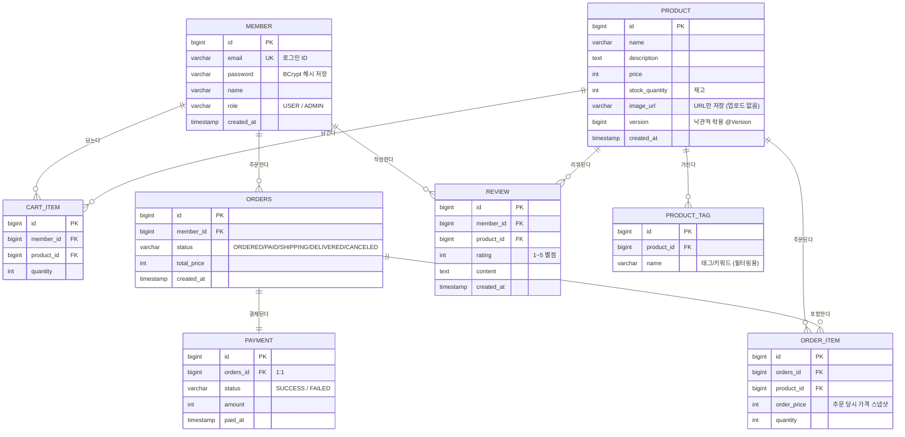

# 🗄️ DB 설계 (ERD)

> Sprint Day 1 산출물. 범위는 [`SPRINT_PLAN.md`](./SPRINT_PLAN.md)의 확정 사항(모의 결제, 이미지 URL, 낙관적 락, 태그 필터)을 따른다.
> GitHub에서 아래 다이어그램이 그림으로 렌더링된다.

## ERD 다이어그램

## 테이블 요약

| 테이블 | 역할 | 관계 |
|--------|------|------|
| `member` | 회원 (일반/관리자) | 주문·장바구니·리뷰의 주체 |
| `product` | 상품 (재고·이미지URL·낙관적 락 버전 포함) | 모든 거래의 대상 |
| `product_tag` | 상품 태그/키워드 | product 1:N — 태그 필터링·키워드 추천용 |
| `cart_item` | 장바구니 항목 | member 1:N, product 1:N |
| `orders` | 주문 (상태 흐름 관리) | member 1:N |
| `order_item` | 주문 상세 (상품별 수량·당시 가격) | orders 1:N, product 1:N |
| `payment` | 모의 결제 기록 | orders 1:1 |
| `review` | 리뷰 (별점 1~5 + 내용) | member 1:N, product 1:N |

## 🔑 설계 결정과 이유 (이해 체크용)

### 1. 왜 `order_item`이 존재하는가 — N:M 해소
회원이 상품을 주문하는 관계는 본질적으로 **N:M**(한 주문에 여러 상품, 한 상품이 여러 주문에)이다.
관계형 DB는 N:M을 직접 표현할 수 없어서 **중간 테이블 `order_item`으로 1:N + N:1 두 개로 쪼갠다.**
`cart_item`도 같은 원리(회원↔상품의 N:M 해소)다.

### 2. 왜 `order_item.order_price`에 가격을 "복사"해 두는가 — 스냅샷
상품 가격은 바뀔 수 있다. 주문 내역이 `product.price`를 참조하면 **과거 주문 금액이 미래의 가격 변경에 따라 왜곡된다.**
그래서 주문 순간의 가격을 `order_price`에 **스냅샷으로 저장**한다. (정규화를 일부러 깨는, 실무에서 흔한 패턴)

### 3. 왜 테이블 이름이 `order`가 아니라 `orders`인가
`ORDER`는 SQL 예약어(`ORDER BY`)라서 테이블명으로 쓰면 쿼리마다 문제가 된다. 관례적으로 `orders`로 피한다.

### 4. `product.version` — 낙관적 락
재고 1개에 주문 2건이 동시에 들어오면, 둘 다 "재고 있음"을 읽고 차감할 수 있다(레이스 컨디션).
`@Version` 컬럼은 **수정할 때마다 번호가 올라가고, 내가 읽은 버전과 다르면 저장을 거부**한다.
→ 늦게 저장한 쪽이 실패하고 재시도/에러 처리된다. (Day 3에서 실제로 구현하며 확인)

### 5. `payment`를 `orders` 컬럼이 아니라 별도 테이블로 둔 이유
결제는 "주문의 속성"이 아니라 **독립적인 사건 기록**(성공/실패, 시각)이다.
모의 결제라도 분리해 두면 실제 PG 연동으로 확장할 때 이 테이블만 커지면 된다.

## 범위에서 뺀 것 (의도적)

- **배송지/주소 테이블** — `orders`에 컬럼 추가로 충분하면 그때 추가 (1주 범위 최소화)
- **찜(wishlist), 쿠폰, 포인트** — 과제 요구사항 아님
- **리뷰의 태그/키워드 분리 테이블** — 추천은 `product_tag` + 별점 평균으로 구현
