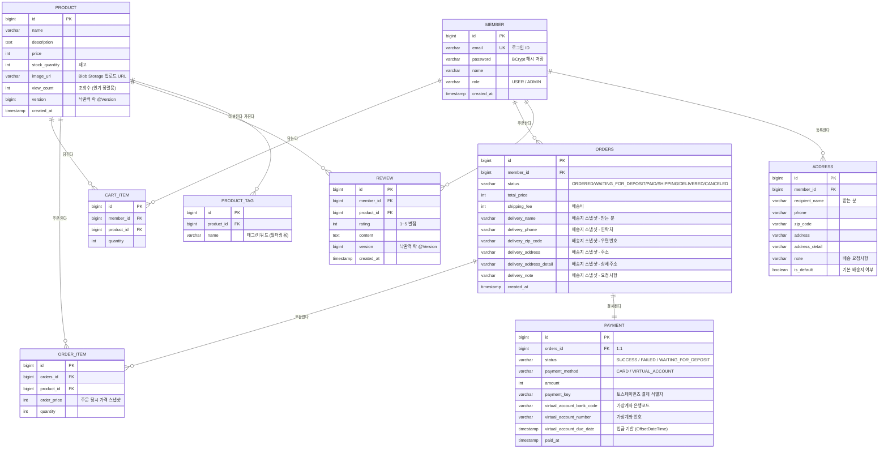

# 🗄️ DB 설계 (ERD)

> **최종 갱신: 2026-08-08** — 실제 엔티티 클래스(`backend/.../domain/`)와 대조해 현행화했습니다.
> Day 1 초안에서 달라진 점은 문서 맨 아래 [설계 변경 이력](#-설계-변경-이력-day-1-초안--현재)에 정리했습니다.
> GitHub에서 아래 다이어그램이 그림으로 렌더링됩니다.

## ERD 다이어그램

## 테이블 요약 (9개)

| 테이블 | 역할 | 관계 |
|--------|------|------|
| `member` | 회원 (일반/관리자) | 주문·장바구니·리뷰·배송지의 주체 |
| `address` | 회원이 저장해 둔 배송지 (기본 배송지 지정 가능) | member 1:N |
| `product` | 상품 (재고·이미지·조회수·낙관적 락 버전) | 모든 거래의 대상 |
| `product_tag` | 상품 태그/키워드 | product 1:N — 태그 필터링·키워드 추천용 |
| `cart_item` | 장바구니 항목 | member 1:N, product 1:N |
| `orders` | 주문 (상태 흐름 + **배송지 스냅샷**) | member 1:N |
| `order_item` | 주문 상세 (상품별 수량·**당시 가격**) | orders 1:N, product 1:N |
| `payment` | 결제 기록 (카드 / 가상계좌) | orders 1:1 |
| `review` | 리뷰 (별점 1~5 + 내용) | member 1:N, product 1:N |

## 🔑 설계 결정과 이유 (이해 체크용)

### 1. 왜 `order_item`이 존재하는가 — N:M 해소
회원이 상품을 주문하는 관계는 본질적으로 **N:M**(한 주문에 여러 상품, 한 상품이 여러 주문에)이다.
관계형 DB는 N:M을 직접 표현할 수 없어서 **중간 테이블 `order_item`으로 1:N + N:1 두 개로 쪼갠다.**
`cart_item`도 같은 원리(회원↔상품의 N:M 해소)다.

### 2. 왜 `order_item.order_price`에 가격을 "복사"해 두는가 — 스냅샷
상품 가격은 바뀔 수 있다. 주문 내역이 `product.price`를 참조하면 **과거 주문 금액이 미래의 가격 변경에 따라 왜곡된다.**
그래서 주문 순간의 가격을 `order_price`에 **스냅샷으로 저장**한다. (정규화를 일부러 깨는, 실무에서 흔한 패턴)

### 3. 왜 테이블 이름이 `order`가 아니라 `orders`인가
`ORDER`는 SQL 예약어(`ORDER BY`)라서 테이블명으로 쓰면 쿼리마다 문제가 된다. 관례적으로 `orders`로 피한다.

### 4. `product.version` — 낙관적 락
재고 1개에 주문 2건이 동시에 들어오면, 둘 다 "재고 있음"을 읽고 차감할 수 있다(레이스 컨디션).
`@Version` 컬럼은 **수정할 때마다 번호가 올라가고, 내가 읽은 버전과 다르면 저장을 거부**한다.
→ 늦게 저장한 쪽이 실패하고, `@Retryable`이 최대 3회 재시도한다. (`OrderConcurrencyTest`로 검증)

### 5. `payment`를 `orders` 컬럼이 아니라 별도 테이블로 둔 이유
결제는 "주문의 속성"이 아니라 **독립적인 사건 기록**이다. 실제로 분리해 둔 덕을 봤다 —
나중에 **가상계좌**를 추가할 때 은행코드·계좌번호·입금기한 3개 컬럼이 필요했는데,
`orders` 테이블을 넓히지 않고 `payment`에만 추가하면 됐다.
(결제 수단이 늘 때마다 주문 테이블이 넓어지는 것을 막는다.)

### 6. `address` 테이블이 있는데 `orders`에도 배송지를 복사해 둔 이유

**§2의 가격 스냅샷과 같은 문제다.** 두 테이블은 역할이 다르다 —
`address`는 **"지금 이 회원의 주소"**(계속 바뀌는 값)이고,
`orders`의 배송지 컬럼은 **"이 주문이 실제로 배송된 곳"**(영원히 변하면 안 되는 값)이다.

`orders`가 `address_id`를 FK로 참조만 했다면 두 가지 사고가 난다.
① 회원이 이사해서 배송지를 수정하면 **3개월 전 주문서의 배송지까지 새 주소로 바뀐다** — 어디로 보냈는지 알 수 없게 된다.
② 회원이 그 배송지를 **삭제하면 과거 주문서의 배송지가 통째로 사라진다** (FK 제약 때문에 삭제 자체가 막히거나, `ON DELETE SET NULL`이면 NULL이 된다).

그래서 주문을 만드는 순간 배송지 값을 `orders`에 **복사(스냅샷)**한다.
이후 `address` 행이 수정되든 삭제되든 주문서는 영향을 받지 않는다.

> 💡 **정규화는 "지금 값"을 다룰 때의 규칙이다.** 주문서·영수증처럼 **과거의 사실을 기록하는 데이터**는
> 일부러 중복 저장하는 게 맞다. 이 프로젝트에서 같은 판단을 두 번 했다 — 가격(§2)과 배송지(§6).

### 7. `product.view_count` — 인기 정렬용 비정규화
"조회수 순 정렬"을 매번 로그 테이블에서 집계하면 상품 목록을 열 때마다 무거운 쿼리가 나간다.
상품 행에 카운터를 직접 두면 정렬이 인덱스 하나로 끝난다.
(정확도보다 **읽기 성능**을 택한 지점 — 조회수는 몇 건 틀려도 서비스에 지장이 없다.)

## 범위에서 뺀 것 (의도적)

- **찜(wishlist), 쿠폰, 포인트** — 과제 요구사항 아님
- **리뷰의 태그/키워드 분리 테이블** — 추천은 `product_tag` + 별점 평균으로 구현
- **결제 재시도 이력 테이블** — 현재는 주문 1건당 결제 1건(1:1). 재시도 이력을 남기려면 1:N으로 확장 필요

## 📌 설계 변경 이력 (Day 1 초안 → 현재)

구현하면서 실제로 달라진 부분입니다. **왜 바뀌었는지**가 이 표의 핵심입니다.

| 변경 | Day 1 초안 | 현재 | 왜 |
|---|---|---|---|
| `address` 테이블 | "범위에서 뺀 것"으로 제외 | **추가됨** | 주문할 때마다 주소를 다시 입력하는 UX가 나빴다. 기본 배송지 기능이 필요해짐 |
| `orders` 배송지 6컬럼 | 없음 | **추가됨** | 배송지 스냅샷 (§6) |
| `orders.shipping_fee` | 없음 | 추가됨 | 배송비를 총액에 합치면 주문서에서 금액 내역을 분리해 보여줄 수 없다 |
| `orders.status` | 5개 | **6개** | 가상계좌 결제를 넣으며 `WAITING_FOR_DEPOSIT` 추가 |
| `payment` 필드 | `status`·`amount`·`paid_at` | **+4개** | 모의 결제 → 실제 토스페이먼츠 연동 (`payment_key`, 가상계좌 3필드) |
| `product.image_url` | "URL만 저장, 업로드 없음" | **Blob Storage 업로드** | 관리자가 파일을 직접 올릴 수 있어야 실사용 가능 |
| `product.view_count` | 없음 | 추가됨 | 인기순 정렬 (§7) |
| `review.version` | 없음 | 추가됨 | 리뷰 동시 수정 방지 |

> ⚠️ **여기서 배운 것:** `spring.jpa.hibernate.ddl-auto=update`는 **컬럼은 추가해도 기존 CHECK 제약조건은 갱신하지 않는다.**
> `OrderStatus`에 `WAITING_FOR_DEPOSIT`을 추가했을 때 테스트는 전부 통과했지만, 실제 운영 DB에는
> 옛날 제약조건(`CHECK (status IN ('ORDERED','PAID',...))`)이 남아 INSERT가 거부됐다.
> → 스키마 이력 관리에는 **Flyway 같은 마이그레이션 도구**가 필요하다. (커밋 `1488c9e`)
