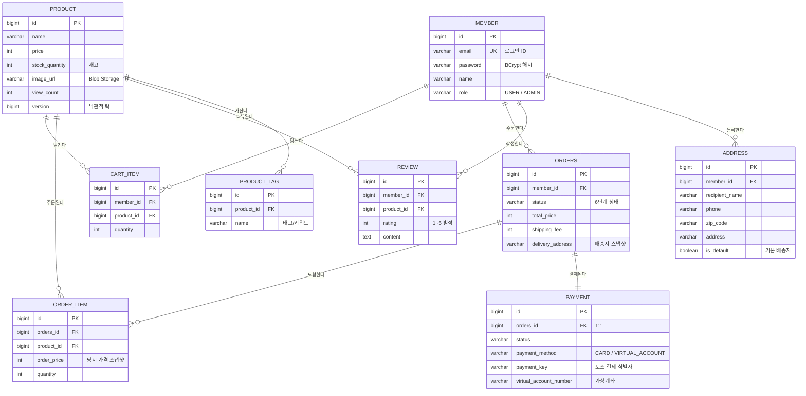

# 최종 결과물 — MINS Farmers Market

> **[개인 프로젝트] 쇼핑몰 만들기** 과제 제출용 종합 문서
> 과제 페이지의 **주요 목표 6개**와 **Step 1~8**을 그대로 따라가며, 각 항목이 이 프로젝트의 어느 코드·문서·화면으로 구현됐는지 근거와 함께 정리했습니다.

| 항목 | 내용 |
|---|---|
| 프로젝트명 | **MINS Farmers Market** — 대전·충남 지역 소농 직거래 쇼핑몰 |
| 배포 주소 | **https://www.minsdev.works** (상시 운영 중) |
| 저장소 | https://github.com/johnjoseph1990/KDT-ShoppingMallProject |
| 개발 기간 | 2026-07-11 ~ 2026-08-08 (약 4주) |
| 인원 | 1인 (최민영) |
| 커밋 수 | 약 218건 (`feat:` 63건 + `fix`/`test`/`refactor`/`docs`) |

---

## ⚠️ 과제 원문과 다른 점 — 배포처를 AWS가 아닌 Azure로 했습니다

과제 Step 7-3은 "AWS에 배포"라고 되어 있으나, **실제 배포는 Microsoft Azure로 진행**했습니다.

**이유:** 수강 중인 KDT 과정의 인프라 강의가 Azure 기준으로 진행되어, 강의에서 배운 내용을
그대로 적용하고 검증할 수 있는 환경이 Azure였습니다. 클라우드 배포로 확인해야 할 학습 목표
— 컨테이너 이미지 빌드·레지스트리 푸시·관리형 DB 연결·환경변수 주입·HTTPS 도메인 연결 —
은 두 클라우드에서 동일하게 달성됩니다.

**대체한 서비스 대응:**

| AWS (과제 원문) | Azure (실제 사용) |
|---|---|
| ECS / App Runner | Azure Container Apps |
| ECR | Azure Container Registry |
| RDS for PostgreSQL | Azure Database for PostgreSQL Flexible Server |
| S3 | Azure Blob Storage |
| Route 53 + ACM | Azure DNS 존 + Container Apps 관리형 인증서 |

인프라 생성 절차는 클릭이 아니라 **`azure/setup.sh` 스크립트 한 파일**로 남아 있어, 동일 구성을
언제든 재생성할 수 있습니다.

---

## 1. 주요 목표 6개 — 달성 현황

각 목표마다 **"무엇을 만들었나"**와 **"어디를 보면 확인되나(근거)"**를 함께 적었습니다.

### 목표 1. 쇼핑몰 서비스의 기본 구조 구현

| 하위 목표 | 구현 내용 | 근거 |
|---|---|---|
| 핵심 도메인 설계·구현 | `member` · `address` · `product` · `product_tag` · `cart_item` · `orders` · `order_item` · `payment` · `review` **9개 테이블** | `backend/.../domain/` (member·address·product·cart·order·payment·review 7개 패키지), [`ERD.md`](./ERD.md) |
| 프론트↔백↔DB 전체 흐름 | React(Vite) → REST API → Spring Boot → JPA → PostgreSQL 전 구간 연결. 화면 16개 | `frontend/src/pages/` 16개 페이지, `backend/.../controller/` 9개 컨트롤러 |

✅ **달성** — 배포 사이트에서 비회원 조회부터 결제까지 실제로 동작합니다.

### 목표 2. Spring 기반 CRUD 및 인증 기능 구현

| 하위 목표 | 구현 내용 | 근거 |
|---|---|---|
| 상품·회원·주문 CRUD | 상품 등록/조회/수정/삭제(이미지 업로드 포함), 회원 정보 수정·탈퇴, 주문 생성/조회 | `ProductController` · `MemberController` · `OrderController`, `ProductServiceTest` · `MemberServiceTest` |
| 회원가입·로그인 | Spring Security 세션 인증, 비밀번호 BCrypt 해시 저장 | `AuthController`, `SecurityConfig`, `MemberServiceTest` |
| 권한 분리 | `USER` / `ADMIN` 역할 분리. URL 패턴(`/api/admin/**` → `hasRole("ADMIN")`) + 메서드 레벨(`@PreAuthorize`) **이중 방어** | `SecurityConfig`, `AdminOrderController`, `AdminOrderControllerTest` |

✅ **달성** — 인가 우회 방지는 컨트롤러 슬라이스 테스트(`@WebMvcTest` + `@Import(SecurityConfig)`)로 검증합니다.

### 목표 3. 주문 및 재고 처리 흐름 고도화

| 하위 목표 | 구현 내용 | 근거 |
|---|---|---|
| 주문 상태 흐름 정의 | `OrderStatus` enum이 전이 규칙을 직접 소유(상태 머신). `ORDERED → PAID → SHIPPING → DELIVERED`, `WAITING_FOR_DEPOSIT`(가상계좌), `CANCELED` | `domain/order/OrderStatus.java`의 `canTransitionTo()` |
| 단계별 상태 변경 로직 | 허용되지 않은 전이는 `changeStatus()`에서 예외 → 400 응답. "배송 시작 후 취소 불가" 같은 규칙이 코드로 강제됨 | `OrderServiceTest` |
| 동시 주문 재고 동기화 | **낙관적 락**(`@Version`) + `@Retryable`(3회, 50ms 백오프)로 초과 판매(oversell) 차단. 3회 실패 시 409 Conflict | `Product.java`의 `@Version`, `OrderService.createOrder()`, **`OrderConcurrencyTest`**(스레드 풀 동시 주문), `OrderServiceRetryTest` |

✅ **달성** — 동시성은 말이 아니라 **실제 멀티스레드 테스트**로 검증합니다.

> 💡 이 목표에서 가장 배운 점: `@Retryable`이 `@Transactional`보다 **바깥**에 있어야 재시도마다 새 트랜잭션이 열립니다. 순서가 반대면 롤백된 트랜잭션을 재사용해 3번 다 실패합니다.

### 목표 4. 관리자 기능 구현

| 하위 목표 | 구현 내용 | 근거 |
|---|---|---|
| 상품·주문 관리 | 관리자 페이지에서 상품 CRUD(재고 포함), 전체 주문 목록 조회 | `AdminPage.jsx`, `AdminOrderController` |
| 주문 상태 변경·재고 확인 | 상태 필터링 + 드롭다운으로 상태 전환. 취소 시 재고 자동 복구 | `AdminOrderController.changeStatus()`, `frontend/e2e/admin.spec.js`(비관리자 차단 검증) |

✅ **달성**

### 목표 5. 리뷰 기반 추천 및 UX 개선

| 하위 목표 | 구현 내용 | 근거 |
|---|---|---|
| 리뷰 작성·조회·삭제 | 별점(1~5) + 내용. 수정도 지원. 본인 리뷰만 삭제 가능(인가 검사) | `ReviewController`, `ReviewServiceTest` |
| 별점 평균·정렬 | 상품별 평균 별점 집계, 평균 별점순 정렬 | `ProductRepository`, `ProductRepositoryBestProductsTest` |
| 키워드·태그 추천/필터 | 리뷰 본문에서 키워드 자동 추출 → 배지 노출. 태그 필터 · 최소 별점 필터 · 베스트 상품 섹션 · 연관 상품 추천 | `KeywordExtractor.java`, `KeywordExtractorTest`, `ProductListPage.jsx` |

✅ **달성**

### 목표 6. 배포 및 결과물 정리

| 하위 목표 | 구현 내용 | 근거 |
|---|---|---|
| 전체 테스트 후 클라우드 배포 | Azure Container Apps 배포, 커스텀 도메인 + HTTPS 적용 | https://www.minsdev.works, `azure/setup.sh` |
| 결과물 정리 | 기획·기능명세·ERD·발표자료·최종결과물(이 문서) | `document/` 폴더 |

✅ **달성** (배포처는 Azure — 위 사유 참조)

---

## 2. Step 1~8 수행 결과

### Step 1. UI 가이드 학습 및 프로젝트 방향 설정 ✅

- **Vapor(Goorm Design System) 학습 → 부분 적용** — 과제 Step 1의 요구는 "학습합니다"이고, 학습 후 **적용 범위는 의도적으로 관리자 화면으로 한정**했습니다.
  - 실제 의존성으로 설치·사용 중입니다 (`@vapor-ui/core` ^1.3.0, `@vapor-ui/icons` ^1.2.0 — `frontend/package.json`).
  - **적용된 곳**: `main.jsx`(전역 `styles.css` 로드), `AdminPage.jsx`(`Badge` · `Button` · `Tabs` · `Table` · `Textarea` · `TextInput` 6개 컴포넌트). 즉 **28개 jsx 중 2개**입니다.
  - **나머지 사용자 화면은 자체 CSS**(`index.css` · `App.css`)로 구현했습니다. 이유는 아래 "디자인 방향" 참조.
- **디자인 방향 — Aesop 벤치마킹 자체 디자인** — 시안 원본은 [`design/`](../design) 폴더의 인터랙티브 HTML 프로토타입(`MINS Farmers Market.dc.html`)이며, **미니멀·세리프 중심의 차분한 톤**을 목표로 했습니다. 이 톤은 Vapor의 기본 컴포넌트 스타일과 결이 달라 사용자 화면은 직접 스타일링하고, **일관된 표·폼·버튼이 중요한 관리자 화면에만 Vapor를 썼습니다.** (디자인 시스템의 값어치가 가장 큰 곳이 관리자 CRUD 화면이라고 판단)
- **주요 화면·사용자 흐름 정리** — 비회원 / 회원 / 관리자 3개 흐름으로 정리했습니다 → [`FUNCTIONAL_SPEC.md` §1](./FUNCTIONAL_SPEC.md)
- **기능 우선순위 설정** — P0(없으면 과제 미달) / P1(과제 요구사항) / P2(여유 시 확장) 3단계로 분류하고, **일정 지연 시 잘라낼 순서**까지 미리 정해뒀습니다 → [`FUNCTIONAL_SPEC.md` §4](./FUNCTIONAL_SPEC.md)
- **방향 설정** — "일반 쇼핑몰"이 아니라 **지역 소농 직거래**로 주제를 좁혔습니다. 상품 수가 적고 제철 개념이 있어 재고·수확 시즌 같은 도메인 규칙을 자연스럽게 넣을 수 있었습니다.

### Step 2. 기능 명세 및 DB 설계 ✅

- **핵심 도메인 정의** — 회원 / 상품 / 장바구니 / 주문 / 결제 / 리뷰
- **테이블 구조·관계 설계** — 9개 테이블 → [`ERD.md`](./ERD.md) (구현하며 달라진 부분은 같은 문서의 **설계 변경 이력**에 기록)
- **기능 명세서 작성** — 기능 ID 부여(M-1, P-1, O-1 …)로 추적 가능하게 → [`FUNCTIONAL_SPEC.md`](./FUNCTIONAL_SPEC.md)
- **일정 계획** → [`SPRINT_PLAN.md`](./SPRINT_PLAN.md)

**설계에서 의도적으로 정규화를 깬 두 지점:**
1. `order_item.order_price` — 주문 당시 가격을 복사. 나중에 상품 가격이 바뀌어도 과거 주문서 금액이 변하면 안 되기 때문
2. 주문의 배송지 스냅샷 — 회원이 주소를 바꿔도 과거 주문서는 그대로여야 하기 때문

### Step 3. Spring 기반 핵심 기능 구현 ✅

- 상품·사용자·주문 CRUD → 컨트롤러 9개 / 서비스 계층 분리
- 회원가입·로그인·인가 → Spring Security 세션 + BCrypt + 역할 기반 접근 제어
- 기본 쇼핑몰 화면 → **16개 페이지** 구현 (홈, 상품목록, 상품상세, 장바구니, 회원가입/로그인, 마이페이지, 주문목록/상세, 결제 성공/실패, 관리자, 수확물, 소개, 스토리, 404)

### Step 4. 주문 및 결제 흐름 구현 ✅

- **구매 흐름** — 장바구니 → 주문서 작성(배송지) → 결제 → 완료
- **주문 상태 관리** — `OrderStatus` 상태 머신
- **결제 연결** — 명세서에는 "모의 결제(P1)"로 잡았으나, **실제 토스페이먼츠 PG를 연동**했습니다.
  - **카드 결제** — 결제창 호출 → 승인 API → `PAID`
  - **가상계좌** — 계좌 발급 → `WAITING_FOR_DEPOSIT` → 입금 확인(폴링) → `PAID`
  - 외부 API는 `PaymentProcessor` 인터페이스로 감싸, 테스트에서는 네트워크 없이 성공/실패 시나리오를 재현합니다 (`TossPaymentProcessorTest`)
- **결제 실패 시 재고 복구** — 주문을 `CANCELED`로 되돌리고 재고를 되돌립니다. 새로고침으로 두 번 호출해도 상태 머신이 이중 복구를 차단합니다.

### Step 5. 재고 및 관리자 주문 처리 기능 확장 ✅

- **재고 로직·UI** — 목록의 품절/마감임박 배지, 상세의 재고 수량 표시, 관리자 재고 수정
- **동시 주문 재고 동기화** — 낙관적 락 + 자동 재시도 (`OrderConcurrencyTest`로 검증)
- **관리자 주문 조회·상태 변경** — 상태 필터 + 상태 전환

**왜 비관적 락이 아닌가:** 일반 쇼핑몰은 같은 상품에 동시 주문이 몰리는 일이 드물어, 매번 락 비용을 내는 비관적 락은 손해입니다. (한정판 티켓팅처럼 충돌이 확실한 도메인이면 반대 선택이 맞습니다.)

### Step 6. 리뷰 기반 추천 및 UX 개선 기능 확장 ✅

- 리뷰 작성/조회/수정/삭제
- 평균 별점 계산 · 별점순 정렬 · 최소 별점 필터
- 키워드 자동 추출(`KeywordExtractor`) · 태그 필터 · 베스트 상품 섹션 · 연관 상품 추천

**한계를 자인해 둔 부분:** `KeywordExtractor`는 사전 기반 매칭이라 동의어·오탈자에 약합니다. 형태소 분석기(Komoran, Okt) 도입이 다음 단계이며, 코드 주석에도 명시해 뒀습니다.

### Step 7. 테스트, 배포 및 결과물 정리 ✅

1. **전체 흐름 점검** — 회원가입 → 주문 → 재고 → 리뷰 → 추천
   - 화면 경로는 Playwright E2E 스모크로 브라우저에서 실제 클릭 검증 (`frontend/e2e/`)
   - 리뷰·추천 로직은 백엔드 테스트로 검증
2. **예외·오류 케이스** — 재고 부족, 동시 주문 충돌(409), 비로그인 접근(401), 권한 없는 접근(403), 잘못된 상태 전이(400)
3. **Azure 배포** — Container Apps + PostgreSQL Flexible Server, `azure/setup.sh`로 재현 가능
4. **배포 링크** — https://www.minsdev.works ✅
5. **시연 영상** — 아래 §6 촬영 대본 참조 ⏳

### Step 8. 과제 제출 ⏳

- 최종 결과물 + 시연 영상 압축 → 아래 §7 제출 패키지 구성 참조

---

## 3. 기능 명세 · 데이터 모델 (요약)

> 상세는 [`FUNCTIONAL_SPEC.md`](./FUNCTIONAL_SPEC.md) · [`ERD.md`](./ERD.md) 참조. 여기서는 요약만 둡니다.

### 구현 기능 한눈에

| 도메인 | 기능 |
|---|---|
| **회원** | 회원가입 · 로그인/로그아웃 · 내 정보 수정 · 탈퇴 · 권한 분리(USER/ADMIN) |
| **상품** | 등록 · 조회 · 수정 · 삭제 · 이미지 업로드(Blob Storage) · 태그 |
| **검색/추천** | 키워드 검색 · 태그 필터 · 최소 별점 필터 · 베스트 상품 · 연관 추천 |
| **장바구니** | 담기 · 수량 변경 · 삭제 |
| **주문** | 주문 생성 · 내역 조회 · 상세 조회 · 배송지 스냅샷 |
| **결제** | 토스페이먼츠 카드 결제 · 가상계좌 발급 · 입금 확인(폴링) |
| **관리자** | 상품 CRUD · 전체 주문 조회 · 상태 필터 · 주문 상태 변경 |
| **리뷰** | 작성 · 조회 · 수정 · 삭제 · 별점 평균 집계 · 키워드 자동 추출 |

### 테이블 9개 — ERD



| 테이블 | 역할 | 관계 |
|---|---|---|
| `member` | 회원 (일반/관리자) | 주문·장바구니·리뷰·배송지의 주체 |
| `address` | 저장된 배송지 (기본 배송지 지정) | member 1:N |
| `product` | 상품 (재고 · 이미지 · 조회수 · 낙관적 락 `version`) | 모든 거래의 대상 |
| `product_tag` | 상품 태그 | product 1:N |
| `cart_item` | 장바구니 항목 | member 1:N, product 1:N |
| `orders` | 주문 (상태 흐름 + **배송지 스냅샷**) | member 1:N |
| `order_item` | 주문 상세 (수량 · **당시 가격**) | orders 1:N, product 1:N |
| `payment` | 결제 기록 (카드 / 가상계좌) | orders 1:1 |
| `review` | 리뷰 (별점 1~5 + 내용) | member 1:N, product 1:N |

> 전체 컬럼과 설계 결정 근거는 [`ERD.md`](./ERD.md) 참조. 같은 문서에 **Day 1 초안 → 현재 설계 변경 이력**도 정리해 뒀습니다.

### 주문 상태 전이도

```
        ORDERED ─── 카드결제 ────────────────▶ PAID ──▶ SHIPPING ──▶ DELIVERED (종착)
           │                                    ▲
           ├──── 가상계좌 ──▶ WAITING_FOR_DEPOSIT ┘  (입금 확인)
           │                        ╎
           ╰────────────────────────┴──────────╌╌▶ CANCELED (종착)
                        (취소는 ORDERED · WAITING_FOR_DEPOSIT · PAID 에서만)
```

---

## 4. 시스템 구성 및 배포

```
┌─────────────┐      ┌──────────────────┐      ┌────────────────────┐
│  React 18   │─────▶│  Spring Boot 3   │─────▶│  PostgreSQL        │
│  (Vite)     │ REST │  Spring Security │ JPA  │  (Flexible Server) │
│  Custom CSS │◀─────│  Spring Data JPA │◀─────│                    │
└─────────────┘      └────────┬─────────┘      └────────────────────┘
                              │
                     ┌────────┴────────┐
                     ▼                 ▼
            ┌────────────────┐  ┌──────────────┐
            │ 토스페이먼츠     │  │ Blob Storage │
            │ (카드·가상계좌)  │  │ (상품 이미지) │
            └────────────────┘  └──────────────┘

                    ⬆ 전부 Azure Container Apps 위에서 동작
```

### 기술 스택

| 구분 | 사용 기술 |
|---|---|
| Backend | Java 17, Spring Boot 3, Spring Data JPA, Spring Security |
| Frontend | React 18, Vite, React Router, Axios, 자체 CSS(사용자 화면) + Vapor(goorm Design System, 관리자 화면) |
| Database | PostgreSQL (테스트는 H2) |
| 결제 | 토스페이먼츠 (카드 · 가상계좌) |
| Infra | Azure Container Apps, Container Registry, PostgreSQL Flexible Server, Blob Storage, DNS |
| CI/CD | GitHub Actions (4 job: backend / frontend / e2e / deploy) |
| 테스트 | JUnit 5, Mockito, Vitest, Testing Library, Playwright |
| 품질 | Spotless(Google Java Format), Prettier, JaCoCo |

### CI/CD 파이프라인 — 배포를 "막는" 것이 목적

```
git push
   │
   ├──▶ [backend]   ./gradlew check + 커버리지 게이트(60% 미만이면 빌드 실패)
   ├──▶ [frontend]  포맷 검사 + 단위 테스트 + 빌드
   └──▶ [e2e]       DB+백엔드+프론트를 러너에 전부 띄우고 브라우저 검증
                              │
                    셋 다 통과해야만 ↓
                          [deploy]  Azure Container Apps
```

`needs: [backend, frontend, e2e]` — 하나라도 실패하면 **배포 잡이 아예 실행되지 않습니다.**

### 재현성 원칙 — "git에 없으면 없는 것"

- **인프라**는 포털 클릭이 아니라 `azure/setup.sh` 스크립트로 남깁니다
- **기준 데이터**(상품·데모 계정)는 `DevDataInitializer`가 **멱등하게** 시드합니다 (`count() > 0` 전체 가드가 아니라 항목별 `existsBy` — 그래야 나중에 상품을 추가해도 들어갑니다)
- **런타임 데이터**(주문·결제·리뷰)는 시드하지 않습니다 — 사용자가 아무 행동도 안 했는데 주문이 존재하는 비현실적 상태를 만들지 않기 위해

클론 → `docker compose up -d db` → `./gradlew bootRun` → `npm run dev` 만으로 누구 PC에서나 동일한 화면이 뜹니다.

---

## 5. 테스트 및 품질

> **측정일: 2026-08-08** (`./gradlew test` · `npm run test:run` 실제 실행 결과)

| 구분 | 개수 | 상태 |
|---|---:|---|
| 백엔드 (JUnit 5 + Mockito) | **279** | ✅ 전부 통과 (실패 0) |
| 프론트엔드 (Vitest + Testing Library) | **114** | ✅ 전부 통과 (15개 파일) |
| E2E 스모크 (Playwright) | **9** | ✅ 전부 통과 (CI 실행 `#31241205478`, 2026-08-08) |
| **합계** | **402** | |

> E2E는 로컬이 아니라 GitHub Actions에서 검증합니다. 이 프로젝트 CI는 `needs: [backend, frontend, e2e]` 구조라, **e2e job이 통과하지 않으면 초록불이 뜨지 않습니다.**

**JaCoCo 커버리지** (제외 규칙 없이 전체 클래스 대상, 2026-08-08 측정)

| 지표 | 수치 |
|---|---|
| 라인 | **98.8%** (1,059줄 중 13줄 미커버) |
| 브랜치 | **87.9%** (165개 중 20개 미커버) |
| CI 하드 게이트 | 60% 미만이면 빌드 실패 |

### 테스트 3계층 전략

| 계층 | 방식 | 검증하는 것 |
|---|---|---|
| `service/` | `@ExtendWith(MockitoExtension.class)` | **비즈니스 로직** — 의존성은 전부 Mock |
| `repository/` | `@DataJpaTest` (실제 H2) | **쿼리가 실제로 도는가** — JPQL 오타·연관관계 |
| `controller/` | `@WebMvcTest` + `@Import(SecurityConfig)` | **HTTP 계약 + 인가** — 상태코드·JSON·권한 |

**왜 나누나:** 전부 통합 테스트로 짜면 느리고, 깨졌을 때 어디가 문제인지 모릅니다. 서비스 테스트가 깨지면 로직 문제, 리포지토리 테스트가 깨지면 쿼리 문제 — 범위가 좁혀집니다.

### E2E가 따로 필요했던 이유

단위 테스트가 전부 통과해도 못 잡는 것이 있습니다 — 프론트가 부르는 URL과 백엔드가 여는 URL이 다를 때, 세션 쿠키가 프록시를 못 넘어갈 때, **백엔드는 막았는데 관리자 화면이 일반 회원에게 그냥 보일 때**. 각 계층은 완벽한데 이어붙인 지점이 깨지는 경우입니다.

핵심 사용자 경로를 브라우저로 실제 클릭합니다: 홈 · 목록→상세 · 회원가입 · 장바구니 · 관리자 · 인증가드.

---

## 6. 시연 영상 촬영 대본 (약 5분)

> 배포 사이트 https://www.minsdev.works 에서 촬영합니다.
> 데모 계정은 `DevDataInitializer`가 시드합니다 — `admin@`(관리자) / `test@`(일반 회원)

| # | 시간 | 화면 | 보여줄 것 | 말할 것 |
|---|---|---|---|---|
| 1 | 0:00~0:20 | 홈 | 이번 주 수확물 섹션, 베스트 상품 | 프로젝트 한 줄 소개 — "지역 소농 직거래 쇼핑몰" |
| 2 | 0:20~0:50 | 상품 목록 | 태그 필터 · 최소 별점 필터 · 검색 | 리뷰 데이터를 필터로 가공한 부분 |
| 3 | 0:50~1:20 | 상품 상세 | 재고 배지, 리뷰 목록, 키워드 배지 | 키워드는 리뷰 본문에서 자동 추출 |
| 4 | 1:20~1:50 | 회원가입 → 로그인 | 유효성 검사 실패도 한 번 보여주기 | 비밀번호는 BCrypt 해시로 저장 |
| 5 | 1:50~2:20 | 장바구니 | 담기 · 수량 변경 · 주문하기 | — |
| 6 | 2:20~3:10 | 주문서 → 결제 | 배송지 입력 → **토스페이먼츠 결제창** → 카드 결제 성공 | 실제 PG 연동. 주문 시점 가격을 스냅샷으로 저장 |
| 7 | 3:10~3:30 | 마이페이지 | 주문 내역 → 주문 상세 → 리뷰 작성 | 상태 표시 확인 |
| 8 | 3:30~4:10 | 관리자 | 관리자 로그인 → 상품 등록 → **주문 상태 변경**(결제완료→배송중) | 같은 API를 권한에 따라 다르게 — 이중 방어 |
| 9 | 4:10~4:40 | (선택) 예외 | 일반 계정으로 `/admin` 직접 접근 시 차단 | 화면과 API 양쪽에서 막힘 |
| 10 | 4:40~5:00 | 마무리 | GitHub Actions 파이프라인 화면 | 셋 다 통과해야 배포됨 |

**촬영 팁**
- **6번(결제)이 가장 중요합니다** — 시간이 부족하면 9·10번을 먼저 자르세요.
- 가상계좌까지 보여주려면 6번 뒤에 30초 추가 (계좌 발급 → 입금대기 상태 확인).
- 브라우저 창은 **1920×1080**, 확대 배율 100%로 두면 글씨가 잘립니다 — **125%** 권장.
- 로그인 상태를 미리 만들어 두지 말고, **비회원부터 시작**해야 흐름이 자연스럽습니다.

---

## 7. 산출물 목록 및 제출 패키지 구성

### 산출물

| 산출물 | 위치 |
|---|---|
| **최종 결과물 문서** (이 파일) | `document/FINAL_DELIVERABLE.md` |
| 발표자료 (29장) | [`document/PRESENTATION.md`](./PRESENTATION.md) |
| 기능 명세서 | [`document/FUNCTIONAL_SPEC.md`](./FUNCTIONAL_SPEC.md) |
| DB 설계 문서 (ERD) | [`document/ERD.md`](./ERD.md) |
| 일정 계획 | [`document/SPRINT_PLAN.md`](./SPRINT_PLAN.md) |
| 배포 검증 체크리스트 | [`document/2026-08-02_배포검증_체크리스트.md`](./2026-08-02_배포검증_체크리스트.md) |
| 학습 기록 | [`docs/learning/`](../docs/learning) |
| **배포 링크** | **https://www.minsdev.works** |
| 소스 저장소 | https://github.com/johnjoseph1990/KDT-ShoppingMallProject |
| 시연 영상 | (촬영 후 첨부) |

### 제출 zip 구성안

```
최민영_쇼핑몰_최종결과물.zip
├── 01_소개자료.pdf            ← PRESENTATION.md / presentation.html  (먼저 읽는 것)
├── 02_최종결과물_상세.pdf     ← 이 문서(FINAL_DELIVERABLE.md)         (근거 확인용)
├── 03_기능명세_ERD.pdf        ← FUNCTIONAL_SPEC.md + ERD.md 합본
├── 04_시연영상.mp4            ← 약 5분 (§6 대본)
└── README.txt                 ← 배포 주소 · GitHub 주소 · 데모 계정 안내
```

> **파일명 앞 번호 = 읽는 순서.** 과제 원문이 요구한 "프로젝트 **소개 자료**"는 01이 맡고,
> Step 1~8 수행 근거는 02(이 문서)가 맡습니다. 한 문서로 둘을 겸하면 어느 한쪽이 망가집니다.
> 변환 절차·주의사항은 [`2026-08-09_과제대조_및_제출계획.md`](./2026-08-09_과제대조_및_제출계획.md) §3-4 참조.

`README.txt` 에 넣을 내용:

```
MINS Farmers Market — KDT 개인 프로젝트 쇼핑몰

배포 주소 : https://www.minsdev.works
소스 코드 : https://github.com/johnjoseph1990/KDT-ShoppingMallProject

데모 계정 (시드 데이터로 자동 생성됨)
  관리자   : admin@shop.com / admin1234
  일반회원 : test@shop.com  / test1234

※ 과제 원문의 "AWS 배포"는 Azure로 대체했습니다 (사유는 최종결과물 문서 참조).
```

---

## 8. 한계와 다음 단계

솔직하게 남은 것들입니다.

1. **Flyway 미도입** — `ddl-auto=update`는 컬럼은 추가해도 기존 CHECK 제약조건을 갱신하지 않습니다. `OrderStatus`에 `WAITING_FOR_DEPOSIT`을 추가했을 때 테스트는 전부 통과하는데 실제 DB INSERT가 거부되는 장애를 겪었습니다(커밋 `1488c9e`). 필요성은 장애로 확인했으나 아직 적용 전입니다.
2. **성능 최적화** — N+1 쿼리 점검과 인덱스 설계가 남아 있습니다. (베스트 상품 조회 쿼리는 이미 한 번 해결했습니다.)
3. **프론트/백 테스트 균형** — 백엔드 279개에 비해 프론트 114개로 상대적으로 얇습니다.
4. **키워드 추출 고도화** — 사전 기반 매칭 → 형태소 분석기(Komoran, Okt) 전환.
5. **CSRF 토큰** — 현재 `csrf.disable()` + 세션 쿠키 `SameSite=Lax`로 부분 방어 중입니다. `CookieCsrfTokenRepository` 도입이 정석입니다.

### 이 프로젝트에서 남은 것

기능 목록보다 오래 남을 것 세 가지:

1. **"왜 이걸 골랐나"를 말할 수 있게 됐다** — 낙관적 락 vs 비관적 락, 세션 vs JWT, 웹훅 vs 폴링. 전부 정답이 아니라 **트레이드오프**였고, 제약을 근거로 골랐습니다.
2. **테스트는 통과 도장이 아니라 설계 피드백이다** — 테스트하기 어려운 코드는 대개 분리가 덜 된 코드였습니다(→ `PaymentProcessor` 인터페이스 분리).
3. **재현되지 않으면 존재하지 않는다** — 인프라도, 데이터도, 배포도 전부 코드로 남겨야 6개월 뒤의 내가 쓸 수 있습니다.

또 하나 — **커버리지 98%가 버그를 막아주지 않는다**는 것도 직접 겪었습니다. 토스 응답의 시간대 오프셋(`2026-07-29T23:59:59+09:00`)을 `LocalDateTime.parse()`로 파싱해 실패했는데, 테스트는 제가 만든 가짜 응답을 쓰니 영원히 통과했습니다. 커버리지는 "코드를 얼마나 실행했나"이지 "내 가정이 맞나"가 아닙니다.
